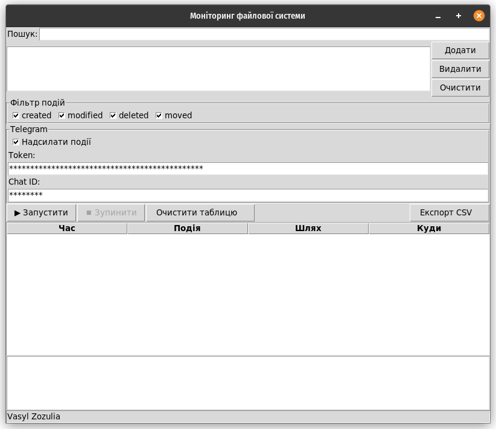
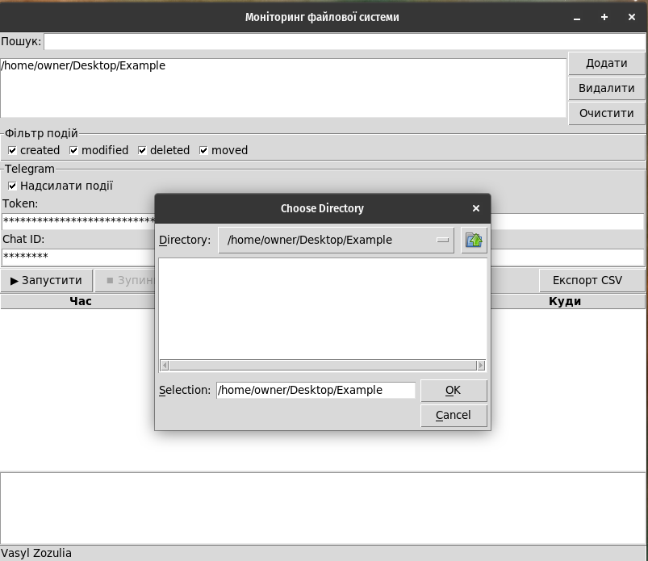
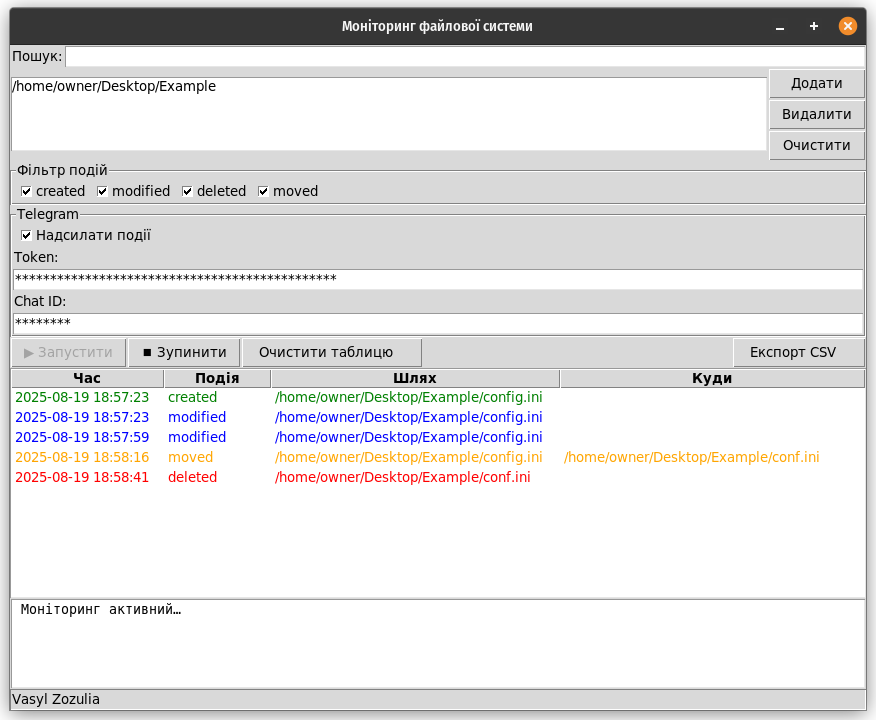
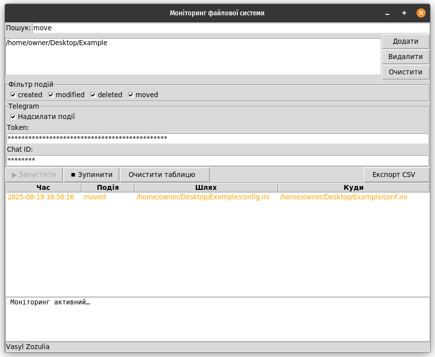
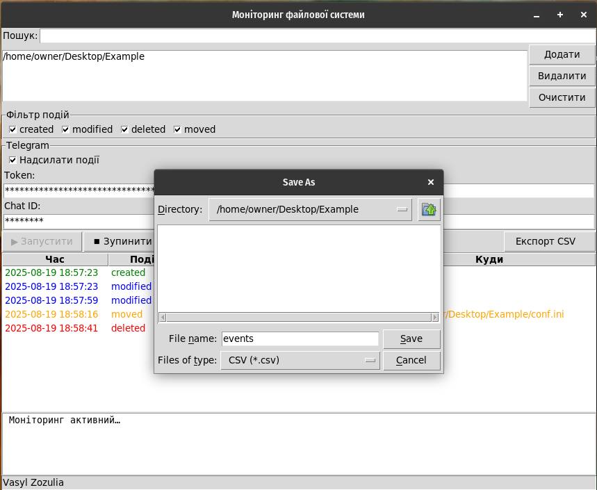
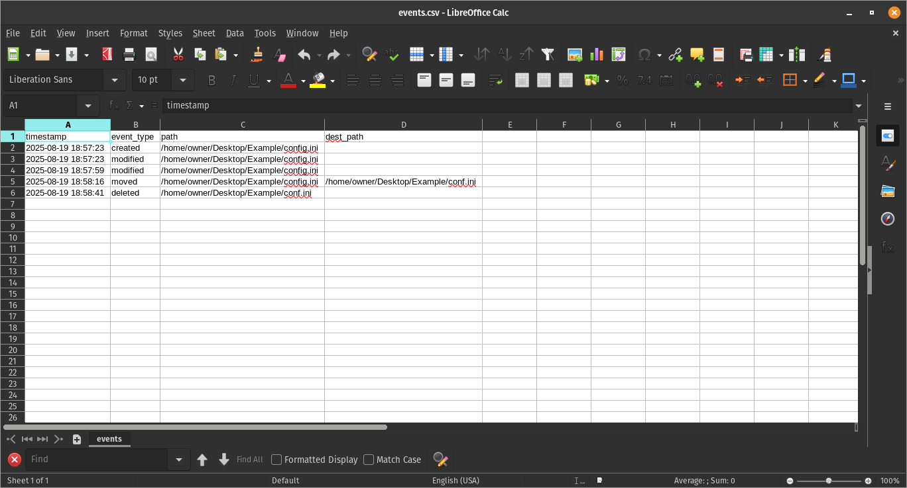
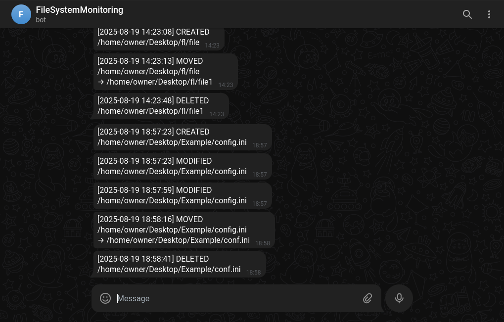

# File System Monitoring

File System Monitoring – це потужний інструмент для моніторингу активності у файловій системі, розроблений для Windows, macOS та Linux. Цей застосунок дозволяє **відстежувати зміни у файловій системі** (створення, редагування, видалення та переміщення файлів) у реальному часі.
## Основне призначення:
    [x] Безпека даних: Виявлення несанкціонованих змін, видалень чи модифікацій.
    [x] Аудит: Ведення детального журналу всіх подій для аналізу та звітності.
    [x] Прозорість: Надання чіткого огляду того, що відбувається з вашими файлами.

---

## Можливості
- Відстеження подій: `created`, `modified`, `deleted`, `moved`
- Моніторинг декількох папок одночасно
- Графічний інтерфейс (Tkinter)
- Фільтрація подій + пошук
- Збереження подій у **SQLite**
- Експорт подій у **CSV**
- Надсилання сповіщень у **Telegram**
- Збереження налаштувань у **YAML**

---

## Скриншоти

---

Автор: [Vasyl Zozulia](https://github.com/VasiaZozulia)
